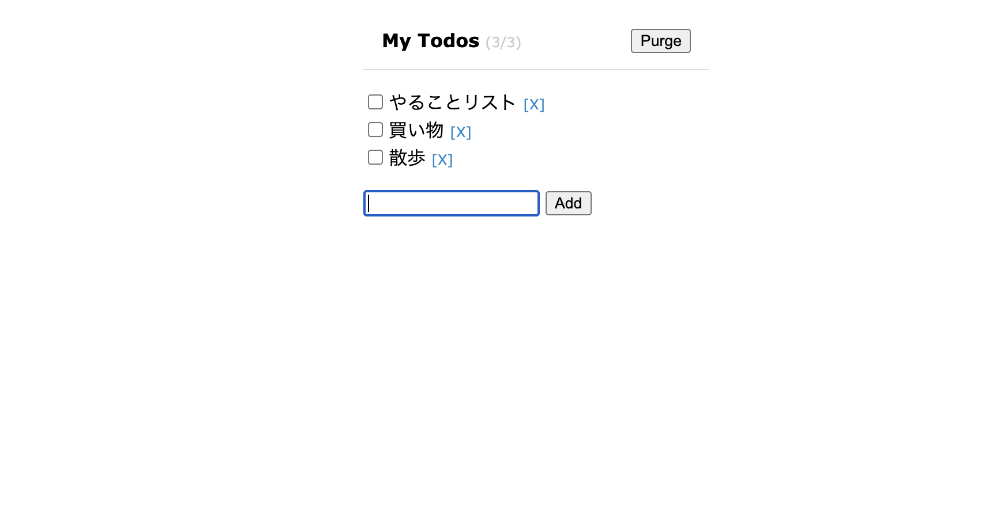

* ３つのリンクを使ってリアクトのTodo-Listを実装

- 以下を`head`に追加する
```html
<script src="https://unpkg.com/react@17/umd/react.development.js"></script>
<script src="https://unpkg.com/react-dom@17/umd/react-dom.development.js"></script>

<!-- Don't use this in production: -->
<script src="https://unpkg.com/@babel/standalone/babel.min.js"></script>
```